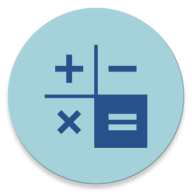
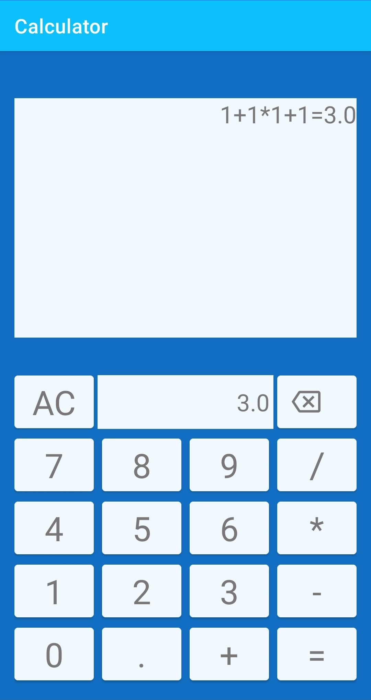

# Calculator

 

### Basic calculator

This app is a basic calculator app with the main math operations. The app can handle multiple consecutive operations while adhering to the 
mathematical rules of operator priority: * / - +. The calculator has a back-button to make corrections and a resetbutton to clear all input and displays.   

#### Project Structure
The app is built with a MVVM architecture (Model-View-ViewModel) using lifecycle elements from Android Jetpack. The app is written in Java. 

Layout inflation and display of input and results is handled by a fragment. A viewmodel is used for processing input and updating live data observed by the fragment.
The viewmodel uses a helper class for performing the calculations. To enable calculation of multiple operations there is also an object class SubOperation,
where an instance consists of one number and the subsequent operator (e.g Suboperation(1.52, +) ). This enables calculation through iteration of a list of SubOperations.

The layout consists of buttons, a textview for displaying input and one for displaying result. The textviews are updated by observing changes in livedata in the viewmodel.
Input data (strings from button press) is sent to viewmodel for processing, i.e handling actions for number input, operators and resets.    
In the viewmodel there are several livedata variables which are used as sources for MediatorLivedata, which is in turn observed by fragment.
Due to some limitations in the usage of mediators it is necessary with two separate lines for the data, one for the input textview and one for the result calculation.
The input/history textview data is sent to viewmodel on each button press, whereas the input for calculation is sent when something other than a number or comma is pressed.

The limitation in the mediator usage creates difficulties upon orientation change, it has not been possible to figure out how to retain state on rotation change without
introducing other issues (crashes and/or loss of observer). The current solution recreates the fragment and viewmodel on rotation.   

Calculating the result is preformed by method calculateResult in ResultService class. Method input is a string with operators ("*/-+") and a list of Suboperations. 
The first operator in the string is used as current operator, and an iteration of the list will perform all matching calculations and update the list. Then one operator is removed and the method repeats through recursion until all operators are used. This way, the result from e.g 1 + 2 * 2 + 1 is calculated as 1 + 4 + 1 = 6, instead of 3 * 2 + 1 = 7. This function took a bit of trial and error to get right. 

#### Error handling
Input errors like zero division are handled by setting an error message in the result textview. Several consecutive operator inputs
are handled as if there was a 0 inbetween, so 1 +* 2 is treated as 1 + 0 * 2. It would be more logical to have the latter operator replace the former.

#### Potential Improvements
- The viewmodel might have more responsibilities than what would be ideal, since it is responsible for all input handling. Maybe this should have been moved, however, the
Android docs on viewmodels do suggest that viewmodels can be used to do more than just holding the data. Also, there are a lot of livedata variables in the viewmodel, but 
it was not possible to find a way to minimize this.

- The layout needs some improvements to work on more phone models. The test model has a large screen and a layout variation for smaller displays should have smaller button text  to fit layout to screen as intended.

- Unit testing was not implemented as I have no previous experience in that area. It would also be preferable to 
write the app in Kotlin, but there was not enough time to learn a new language.

#### Resources
No third party libraries were used for the project. The app icon was made in Adobe Spark Post for Android. 
 

  - [**Model-package**](app/src/main/java/com/hle/calculator/Model) contains SubOperation class and a ResultService class that handles calculation and number check.
  - [**View-package**](app/src/main/java/com/hle/calculator/View) contains mainactivity and fragment. 
  - [**ViewModel-package**](app/src/main/java/com/hle/calculator/ViewModel) contains viewmodel only.
  
